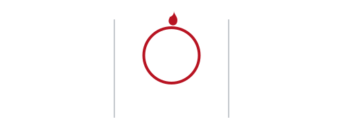
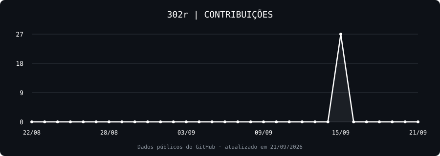

<h1 align="center">302r</h1>

  

  

### TTT

  
  
  
  
  
  
  
  

### PPP

- **Automações:** scripts e ferramentas para simplificar tarefas.
- **APIs:** integração entre serviços e projetos.
- **IA aplicada:** experimentos com inteligência artificial em projetos.
- **Interfaces e desktop:** desenvolvimento com tecnologias web e PyWebView.
- **Edição e mídia:** processamento de áudio e vídeo com FFmpeg.
- **Games:** estudos e projetos experimentais.

### SSS

### CCC

  

